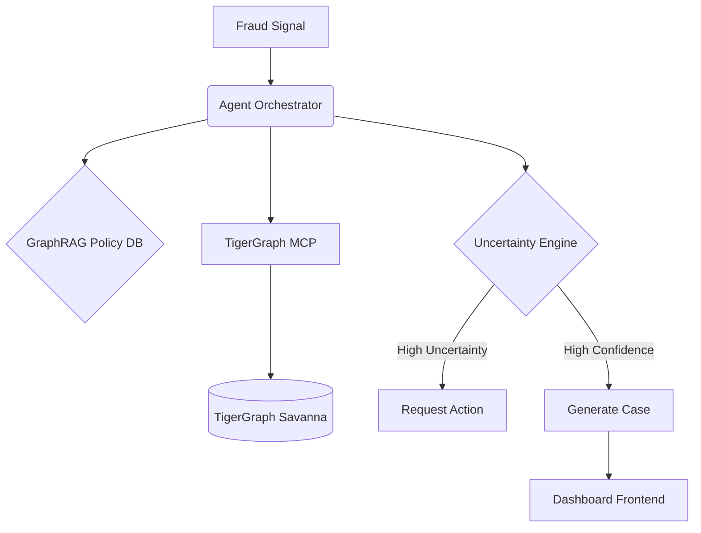

# Architecture Overview

- **Backend**: FastAPI + Python 3.9+ + Pydantic v2
- **Agent Framework**: LangGraph + TigerGraph MCP
- **GraphDB**: TigerGraph (GSQL)
- **Frontend**: Next.js 15 + Tailwind CSS
